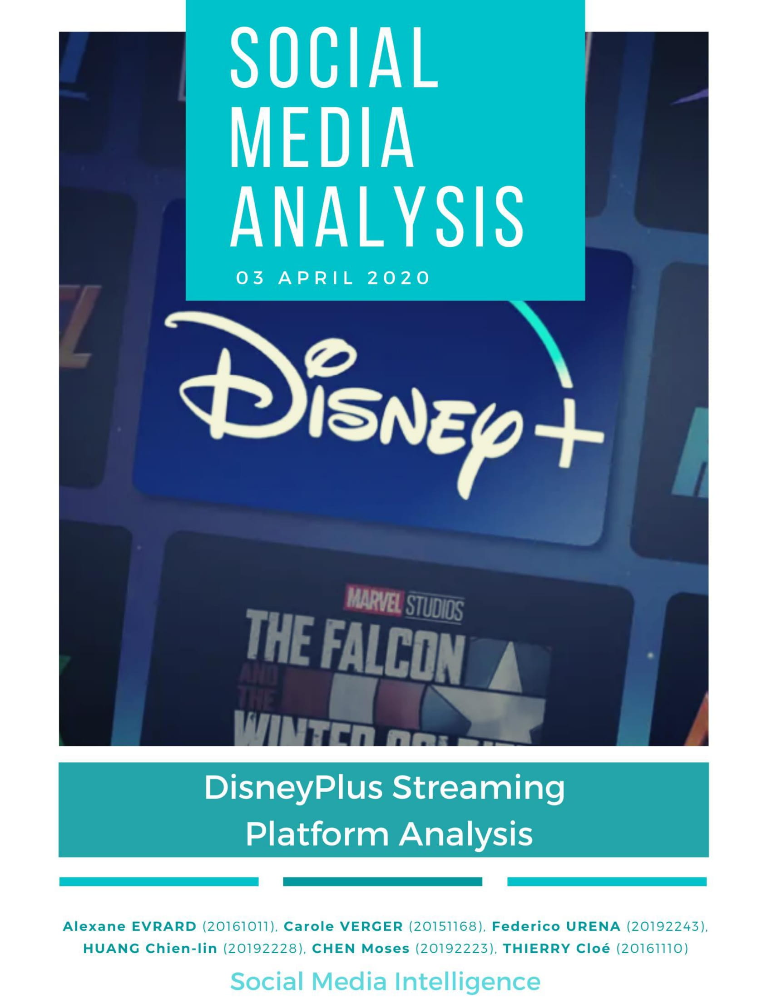
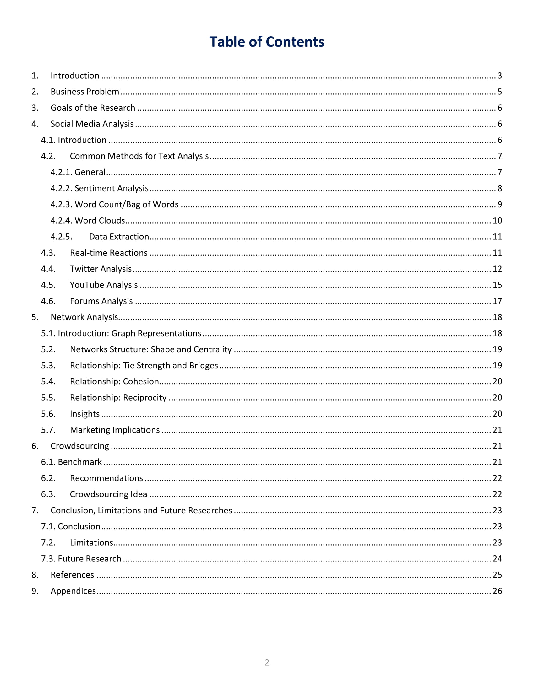

# Sentiment_Analysis_DisneyPlus

In this analysis project, we mainly focus on people's reaction of the releasing series called "The Mandalorian", the following story of the "StarWar"
We obtain the resources from channel including Youtube, Twitter and Forum(Reddit).
The following content is included in the analysis:
- Sentiment analysis(Finding out that in general people's reaction are positive, negative or neutral)
- Word Bagging(Counting each word showing up times in each channel and print the top ten words showing most of times)
- Word Cloud(Visualizing the counting words, the bigger the word is, the more times it shows up)
- Word Tagging(The proportion of each type of words be mentioned, like people's name, location name or others.
- Network Analysis(What is the relationship between users, for example who retweet whose messages)

This Project is written by Alexane Evrard, Carole Verger, Me, Chien Lin Huang, Federico Urena, Thierry Cloe.
The full version of Report Please check[DISNEY_PLUS_REPORT_VF.pdf](https://github.com/YH-Chen1225/Text-Mining-DisneyPlus/files/10102823/DISNEY_PLUS_REPORT_VF.pdf)
